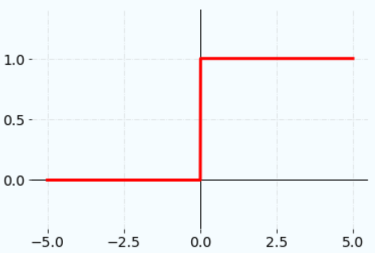

# Activation Functions

## Definition

- Introduces non-linearity into models for solving non-linear problems;
- Allows networks to learn complex patterns & relationships in data;
- Without an activation function, neural networks are just linear regression models.

## Binary Step

$$
f(x) = \begin{cases}
    0 & for & x < 0 \\
    1 & for & x \geq 0
\end{cases}
$$

- Simplest threshold activation function;
- Used for binary classification problems.

## Rectified Linear Unit (ReLU)

- **Sparse activation**: less neurons activated so less computation & identifies
  most relevant features;
- **Better gradient propagation**: less vanishing gradient problem than sigmoid
  or TanH so better training for deeper network;
- **Not zero-centered**: outputs always positive so not suitable for data that
  has negative values;
- **No upper bound**;
- Used in **computer vision** & **speech recognition**.

## Sigmoid (logistic)

- **Probabilistic interpretation**: maps the entire number line into a small
  range such as between 0 and 1;

## Hyperbolic Tangent (TanH)

- Similar to sigmoid, but the output range is -1 to 1.

## References

- [CodeCademy—Binary Step Activation Function](https://www.codecademy.com/resources/docs/ai/neural-networks/binary-step-activation-function)
- [SAGAR SHARMA—Activation Function in Neural Networks](https://towardsdatascience.com/activation-functions-neural-networks-1cbd9f8d91d6)
