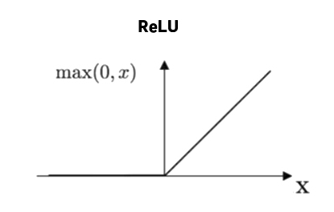
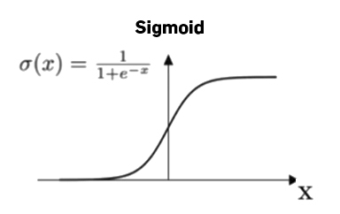
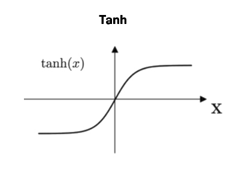

# Activation Functions

## Definition

- Introduces non-linearity into models for solving non-linear problems;
- Allows networks to learn complex patterns & relationships in data;
- Without an activation function, neural networks are just linear regression models.

## Binary Step

## Rectified Linear Unit (ReLU) 

- **Sparse activation**: less neurons activated so less computation & identifies
  most relevant features;
- **Better gradient propagation**: less vanishing gradient problem than sigmoid
  or TanH so better training for deeper network;
- **Not zero-centered**: outputs always positive so not suitable for data that
  has negative values;
- **No upper bound**;
- Used in **computer vision** & **speech recognition**.

## Sigmoid (logistic)

- **Probabilistic interpretation**: maps the entire number line into a small
  range such as between 0 and 1;

## Hyperbolic Tangent (TanH)

- Similar to sigmoid, but the output range is -1 to 1.

## References

- [SAGAR SHARMA—Activation Function in Neural Networks](https://towardsdatascience.com/activation-functions-neural-networks-1cbd9f8d91d6)
