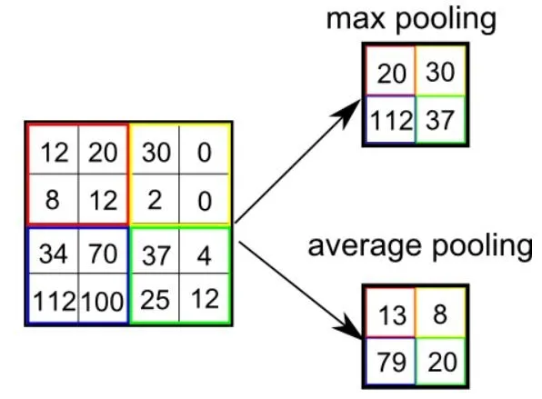

# Convolutional Neural Networks

## Definition

* Type of [feed-forward neural network](https://opixelum.gitbook.io/brain-disk/artificial-intelligence/neural-networks/feed-forward-neural-network.md);
* **Extract attributes** by from **grid-like data** (images, 2D data, etc.) via
  **filters** (aka **kernels**).

## Layers

### Convolutional Layers

- Most of the computation is done here;
- Extracts attributes from the input data;
- The number of neurons is equal to the number of filters (kernels);
- Each neuron has a different kernel;
- Each neuron processes a part of the input data (receptive field) at the time.
  When it is done with a receptive field, it moves to the next one;
- After a neuron has processed the whole input data, it results in a feature
  map.

### Pooling Layers

- Reduces the spatial dimension of the input data;
- Helps reduce the number of parameters and computational complexity in the
  network;
- Common methods are average and max pooling.

### Fully Connected Layers

## References

* [DataCamp—An Introduction to Convolutional Neural Networks (CNNs)](https://www.datacamp.com/tutorial/introduction-to-convolutional-neural-networks-cnns)
* [DeepAI—Convolutional Neural Network](https://deepai.org/machine-learning-glossary-and-terms/convolutional-neural-network)
* [FreeCodeCamp—What Is a Convolutional Neural Network? A Beginner's Tutorial for Machine Learning and Deep Learning](https://www.freecodecamp.org/news/convolutional-neural-network-tutorial-for-beginners/)
* [MATLAB & Simulink—What Is a Convolutional Neural Network?](https://www.mathworks.com/discovery/convolutional-neural-network-matlab.html)
* [Nvidia—Convolutional Neural Networks](https://www.nvidia.com/en-us/glossary/data-science/convolutional-neural-network/)
* [TechTarget—convolutional neural network (CNN)](https://www.techtarget.com/searchenterpriseai/definition/convolutional-neural-network)
* [TowardsDataScience—A Comprehensive Guide to Convolutional Neural Networks — the ELI5 way](https://towardsdatascience.com/a-comprehensive-guide-to-convolutional-neural-networks-the-eli5-way-3bd2b1164a53)
* [TowardsDataScience—Convolutional Neural Networks, Explained](https://towardsdatascience.com/convolutional-neural-networks-explained-9cc5188c4939)
* [Wikipedia—Convolutional neural network](https://en.wikipedia.org/wiki/Convolutional_neural_network)
