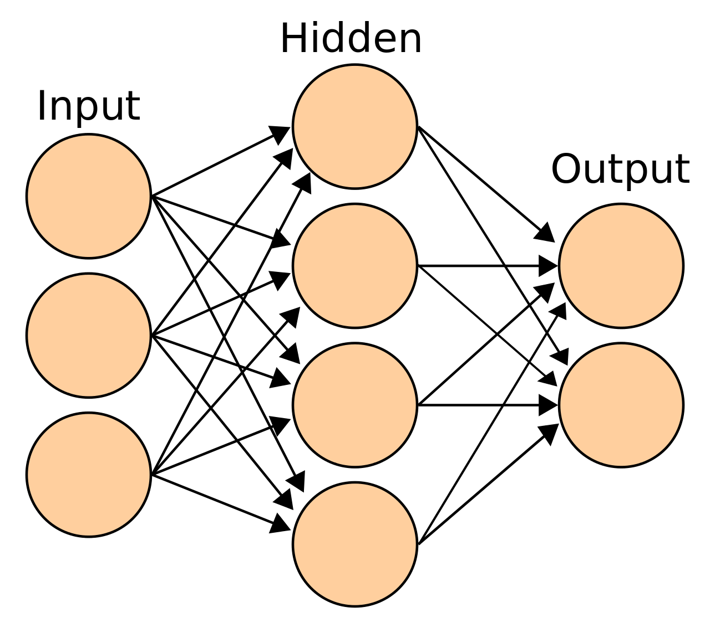
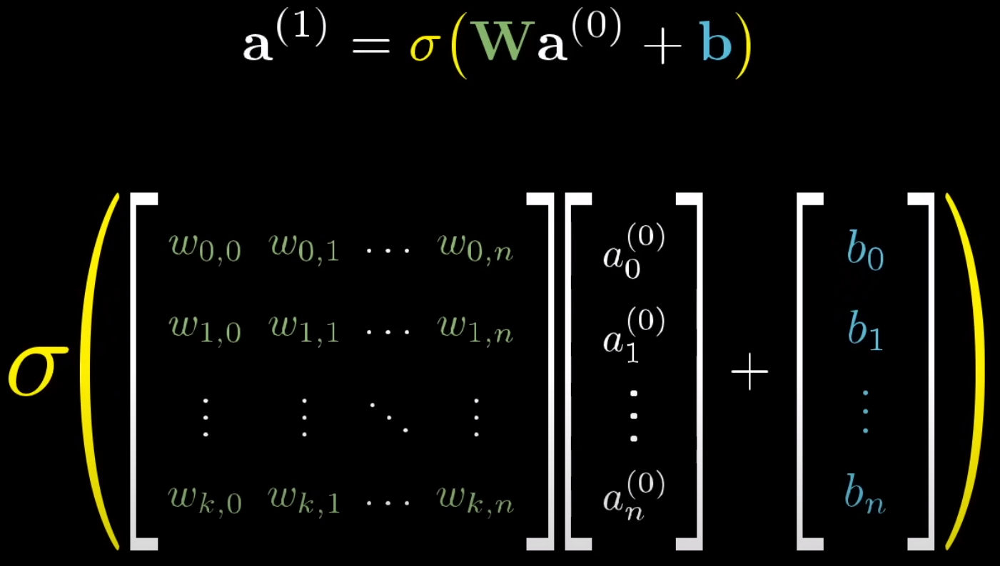

# Neural Networks

## Definition

Computational models inspired by the human brain, represented by groups of nodes
interconnected.
They are composed of artificial neurons and are used to solve complex problems.
In machine learning, a neural network has a single hidden layer, whereas in deep
learning, it has multiple hidden layers.

## Neurons

- Holds a function that takes one or more inputs and returns one output;
- The output is the result of the activation function applied to the sum of the
  inputs multiplied by their respective weights and added to the bias.

- **σ** is the activation function (sigmoid in the example, but it can be
  another like ReLU, tanh, etc.); 
- **W** is the weight;
- **a** is the input;
- **b** is the bias.

## Parameters

- Values updated during the training process (aka backpropagation) using
  optimization algorithms like gradient descent, RMSProp or Adam;
- Used to minimize the error between the predicted and the actual output.

### Weights

- Value that determines the strength of the connection between two neurons;
- Decides how much influence the input will have on the output.

### Biases

- Value added to the product of features and weight;
- Used to shift the activation function to the left or right (negative or
  positive) for ensuring an activation even if all inputs are zero as a
  threshold;
- Akin to the intercept term in a linear equation.
