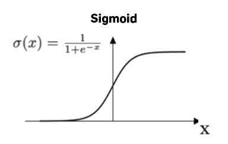
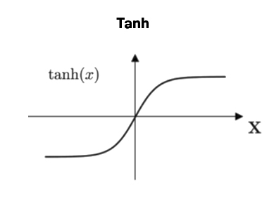

# Neural Networks

## Definition

Computational models inspired by the human brain, represented by groups of nodes
interconnected.
They are composed of artificial neurons and are used to solve complex problems.
In machine learning, a neural network has a single hidden layer, whereas in deep
learning, it has multiple hidden layers.

## Neurons

- Holds a function that takes one or more inputs and returns one output;
- The output is the result of the activation function applied to the sum of the
  inputs multiplied by their respective weights and added to the bias.

- **σ** is the activation function (sigmoid in the example, but it can be
  another like ReLU, TanH, etc.); 
- **W** is the weight;
- **a** is the input;
- **b** is the bias.

## Parameters

- Values updated during the training process (aka backpropagation) using
  optimization algorithms like gradient descent, RMSProp or Adam;
- Used to minimize the error between the predicted and the actual output.

### Weights

- Value that determines the strength of the connection between two neurons;
- Decides how much influence the input will have on the output.

### Biases

- Value added to the product of features and weight;
- Used to shift the activation function to the left or right (negative or
  positive) for ensuring an activation even if all inputs are zero as a
  threshold;
- Akin to the intercept term in a linear equation.

## Activation Functions

- Introduces non-linearity into models for solving non-linear problems;
- Allows networks to learn complex patterns & relationships in data;
- Without an activation function, neural networks are just linear regression models.

### Rectified Linear Unit (ReLU) 

- **Sparse activation**: less neurons activated so less computation & identifies
  most relevant features;
- **Better gradient propagation**: less vanishing gradient problem than sigmoid
  or TanH so better training for deeper network;
- **Not zero-centered**: outputs always positive so not suitable for data that
  has negative values;
- **No upper bound**;
- Used in **computer vision** & **speech recognition**.

### Sigmoid (logistic)

- **Probabilistic interpretation**: maps the entire number line into a small
  range such as between 0 and 1;

### Hyperbolic Tangent (TanH)

- Similar to sigmoid, but the output range is -1 to 1.

## Learning (Training or Fitting)

Process of updating the weights and biases of a neural network to minimize the
error between the predicted and the actual output.

### Backpropagation

- **Loss function**: measures the difference between the predicted and the
  actual output.
  A high value means the model is not performing well;
- **Optimization algorithm**: updates the weights and biases of the network to
  **minimize the loss function**.
  Examples are gradient descent, RMSProp or Adam.

### Overfitting/Underfitting

- **Overfitting**: dataset is too small, or the model is too complex, so the
  model learns the training data too well and is not able to generalize to new
  data;
- **Underfitting**: model is too simple, so it is not able to learn the training
  data, letting room for improvement.

## References

- [AI Wiki—Weights and Biases](https://machine-learning.paperspace.com/wiki/weights-and-biases)
- [Builtin—How Does Backpropagation in a Neural Network Work?](https://builtin.com/machine-learning/backpropagation-neural-network)
- [DeepAI—What is Backpropagation?](https://deepai.org/machine-learning-glossary-and-terms/backpropagation)
- [DeepAI—What is the Sigmoid Function?](https://deepai.org/machine-learning-glossary-and-terms/sigmoid-function)
- [Encord—Activation Functions in Neural Networks: With 15 examples](https://encord.com/blog/activation-functions-neural-networks)
- [Neptune—A Comprehensive Guide to the Backpropagation Algorithm in Neural Networks](https://neptune.ai/blog/backpropagation-algorithm-in-neural-networks-guide)
