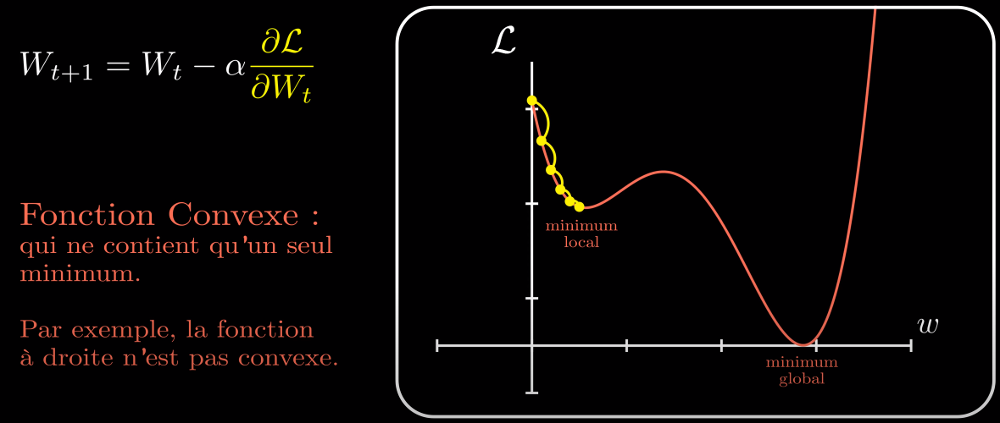

# Gradient Descent

- Type d'algorithme d'optimisation :
  - Stochastic Gradient Descent (SGD)
  - Batch Gradient Descent (BGD)
  - Adam
  - RMSProp
  - AdaGrad
- But : minimiser la fonction de loss
- Gradient = dérivée partielle
- Learning rate : hyper paramètre
- Si gradient négatif, la fonction de loss diminue lorsque le poids augmente.
- Si gradient positif, la fonction de loss augmente lorsque le poids augmente.

- La fonction de loss doit être convexe, c'est à dire sans minimum local, sinon
  l'algorithme peut rester bloqué sur ce dernier, empêchant la minimisation.

- Moins la fonction de loss est convexe (plus il y a de minimum locaux), plus
  il est difficile de minimiser la fonction si le learning rate est fixe.
  Un learning rate adaptif (qui varie entre chaque itération de l'algorithme)
  peut permettre de sortir d'un minimum local.
  Par défaut, le SGD (Stochastic Gradient Descent) ou BGD (Batch Gradient Descent)
  ont un learning rate fixe. D'autres algorithme de déscente de gradient (Adam,
  AdaGrad, RMSProp) ont un learning rate adaptif.

## Sources

- [Machine Learnia - Le Perceptron (YouTube)](https://www.youtube.com/watch?v=VlMm4VZ6lk4)
