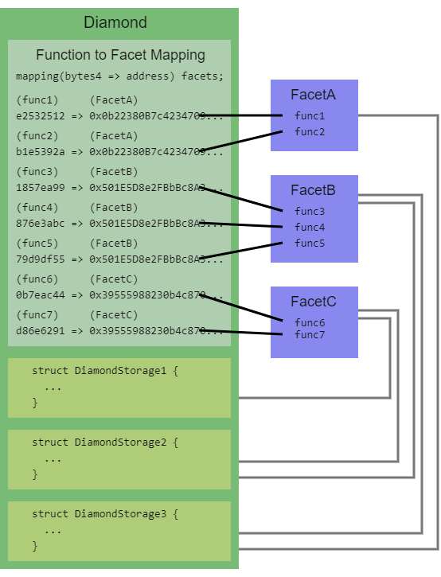

# Diamond Pattern (smart contract)

## Introduction

The diamond pattern is a **modular smart contract system** that can be
**updated after deployment**, with **no size limit**. It has been proposed in
the [EIP-2535](https://eips.ethereum.org/EIPS/eip-2535) the 22nd of February
2020.

## Specifications

- The main contract is called a **diamond**. This contract is like a **proxy**
that delegates all calls to **facets**.

- **Facets are contracts or libraries** that implements functions that can be
called by the diamond.

- **Diamond are stateful**, meaning that it can store data, meanwhile the
**facets are stateless**. It can read & write to the storage of the diamond.

- A special facet is the **loupe facet**. It provides **introspection**
**functions** (functions that return information about the diamond and its
facets).

- A diamond can have multiple facets, and **a facet can be used by multiple
diamonds**.


## Benefits

- A single address for unlimited contract functionality;
- Can exceed the 24KB current smart contract size limit;
- Better organization of contract code and storage;
- Better upgradeability;
- A diamond can be immutable;
- A diamond can reuse deployed contracts;
- Simplified event handling.

## Structure of a diamond

- A diamond implements a mapping of function selectors to facets. It takes the
first 4 bytes of the function call and uses it as a key to find the facet that
implements the function.



- **All diamonds must implement the `IDiamond` interface.** This interface
contains the **event `DiamondCut` that must be emitted when any external**
**function is added, replaced or removed**.

```solidity
interface IDiamond {
    enum FacetCutAction {Add, Replace, Remove}
    // Add=0, Replace=1, Remove=2

    struct FacetCut {
        address facetAddress;
        FacetCutAction action;
        bytes4[] functionSelectors;
    }

    event DiamondCut(FacetCut[] _diamondCut, address _init, bytes _calldata);
}
```

- **All diamonds must implement the `IDiamondLoupe` interface.** This interface
contains functions that return information about the diamond and its facets.

```solidity
// A loupe is a small magnifying glass used to look at diamonds.
// These functions look at diamonds
interface IDiamondLoupe {
    struct Facet {
        address facetAddress;
        bytes4[] functionSelectors;
    }

    /// @notice Gets all facet addresses and their four byte function selectors.
    /// @return facets_ Facet
    function facets() external view returns (Facet[] memory facets_);

    /// @notice Gets all the function selectors supported by a specific facet.
    /// @param _facet The facet address.
    /// @return facetFunctionSelectors_
    function facetFunctionSelectors(address _facet) external view returns (bytes4[] memory facetFunctionSelectors_);

    /// @notice Get all the facet addresses used by a diamond.
    /// @return facetAddresses_
    function facetAddresses() external view returns (address[] memory facetAddresses_);

    /// @notice Gets the facet that supports the given selector.
    /// @dev If facet is not found return address(0).
    /// @param _functionSelector The function selector.
    /// @return facetAddress_ The facet address.
    function facetAddress(bytes4 _functionSelector) external view returns (address facetAddress_);
}
```

- Diamonds should implement the `IDiamondCut` interface, which contains the
function `diamondCut` that is used to add, replace or remove facets.

```solidity
interface IDiamondCut is IDiamond {
    /// @notice Add/replace/remove any number of functions and optionally execute
    ///         a function with delegatecall
    /// @param _diamondCut Contains the facet addresses and function selectors
    /// @param _init The address of the contract or facet to execute _calldata
    /// @param _calldata A function call, including function selector and arguments
    ///                  _calldata is executed with delegatecall on _init
    function diamondCut(
        FacetCut[] calldata _diamondCut,
        address _init,
        bytes calldata _calldata
    ) external;
}
```

## References

- [EIP-2535](https://eips.ethereum.org/EIPS/eip-2535)
- [A standard for organizing and upgrading a modular smart contract system](https://soliditydeveloper.com/eip-2535)
