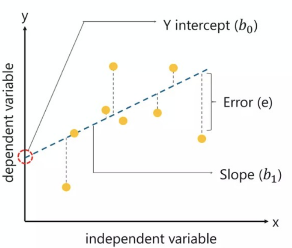

# Data Mining

## Definition

- Process of discovering meaningful new correlations, patterns, and trends by
sifting through large amounts of data.

- Analysis of observational data sets to find unsuspected relationships and to
summarize data in novel ways.

- Interdisciplinary field bringing together techniques from machine learning,
pattern recognition, statistics, databases, and visualization.

- Exploration and analysis of large quantities of data in order to discover
previously unknown meaningful and actionable patterns and rules.

## Statistics key values

### Quartile

- Q1: 25% of the values are less than Q1.

Excel formula:

```excel
=QUARTILE([array], 1)
```

- Q2 (or median): 50% of the values are less than Q2.

Excel formula:

```excel
=QUARTILE([array], 2)
```

- Q3: 75% of the values are less than Q3.

Excel formula:

```excel
=QUARTILE([array], 3)
```

- IQR (interquartile range): Q3 - Q1

Formula:

```c
Q3 - Q1
```

### Outlier

Extremely low or extremely high data point relative to the nearest data point.

Formula:

```c
outlier < Q1 - 1.5 * (IQR) || outlier > Q3 + 1.5 * (IQR)
```

## Processing Data

1. Collect data
2. Import data in spreadsheet (Excel, Calc, Numbers, ...)
3. Clean, transform data & build data model
4. Build reports, visualizations & dashboards that deliver useful information

## Collecting Data

### Database

Relational databases, such as SQL Server, Oracle, MySQL, and IBM DB2, are used
to store data in an organized manner in these systems. Data from databases and
data warehouses can be utilized as an analysis source.

### API

APIs, or Application Program Interfaces, and Web Services are provided by many
data providers and websites, allowing various users or programs to communicate
with and access data for processing or analysis.

### Open Data

Open data is data that is openly accessible, exploitable, editable and shared
by anyone for any purpose, even commercially. Open data is licensed under an
open license.

### Web Scrapping

Web scraping is a technique for obtaining meaningful data from unstructured
sources. Online scraping, allows to retrieve data from websites depending on
predefined parameters.

## Importing Data in Spreadsheet

Cell by cell input is no longer suitable when a large amount of data must be
processed. A standard input format is then necessary.

Multiple format are available to enter bulk data in a spreadsheet:

- TXT / CSV
- XML
- Web
- Database

## Data Exploration

Data exploration refers to the initial step in data analysis in which data
analysts use data visualization and statistical techniques to describe dataset
characterizations, such as size, quantity, and accuracy, in order to better
understand the nature of the data.

## Data Visualization

The process of displaying data (often in large quantities) in a meaningful
fashion to provide insights that will support better decisions.

It improves decision-making, provides managers with better analysis
capabilities that improves collaboration and information sharing.

### Tabular vs Visual Data Analysis

Tabular data can be used to determine exactly how many units of a certain
product were sold in a particular month, or to compare one month to another.

A Visual Chart provides the means to:

- Easily compare overall sales of different products (Product C sells the
least, for example);

- Identify trends (sales of Product D are increasing), other patterns (sales of
Product C is relatively stable while sales of Product B fluctuates more over
time), and exceptions (Product E’s sales fell considerably in September).

### Conditionnal Formatting

Conditional formatting makes it easy to highlight certain values or make cells
easy to identify. This changes the appearance of a cell range based on a
condition (or criteria).

You can use conditional formatting to highlight cells that contain values which
meet a certain condition. Or you can format a whole cell range and vary the
exact format as the value of each cell varies.

### Charts

#### Column & Bar Charts

Excel distinguishes between vertical and horizontal bar charts, calling the
former column charts and the latter bar charts.

A clustered column chart compares values across categories using vertical
rectangles:

- a stacked column chart displays the contribution of each value to the total
by stacking the rectangles;

- a 100% stacked column chart compares the percentage that each value
contributes to a total.

Column and bar charts are useful for comparing categorical or ordinal data, for
illustrating differences between sets of values, and for showing proportions or
percentages of a whole.

#### Line Charts

Line charts provide a useful means for displaying data over time.

You may plot multiple data series in line charts; however, they can be
difficult to interpret if the magnitude of the data values differs greatly. In
that case, it would be advisable to create separate charts for each data
series.

#### Pie Charts

A pie chart displays this by partitioning a circle into pie-shaped areas
showing the relative proportion.

Data visualization professionals don't recommend using pie charts. In a pie
chart, it is difficult to compare the relative sizes of areas; however, the
bars in the column chart can easily be compared to determine relative ratios of
the data.

- If you do use pie charts, restrict them to small numbers of categories,
always ensure that the numbers add to 100%, and use labels to display the group
names and actual percentages. Avoid three-dimensional (3D) pie charts,
especially those that are rotated, and keep them simple.

#### Area Charts

An area chart combines the features of a pie chart with those of line charts.

Area charts present more information than pie or line charts alone but may
clutter the observer’s mind with too many details if too many data series are
used; thus, they should be used with care.

#### Scatter Charts

Scatter charts show the relationship between two variables. To construct a
scatter chart, we need observations that consist of pairs of variables.

#### Bubble Charts

A bubble chart is a type of scatter chart in which the size of the data marker
corresponds to the value of a third variable; consequently, it is a way to plot
three variables in two dimensions.

#### Box Plot

A Box Plot in Excel is a graphical representation of the numerical values of a
dataset. It shows a five-number summary of the data, which consists of the
minimum, maximum, first quartile, second quartile (median), and third quartile.

#### Sparklines

Sparklines are tiny charts that reside in a cell in Excel. These charts are
used to show a trend over time or the variation in the dataset. You can use
these sparklines to make your bland data look better by adding this layer of
visual analysis.

#### Control Charts

The control chart is a graph used to study how a process changes over time.
Data are plotted in time order.

A control chart always has a central line for the average, an upper line for
the upper control limit, and a lower line for the lower control limit. These
lines are determined from historical data.

## Data Cleaning

- Remove duplicates
- Separate different data from one column to multiple columns
- Change case (lower, upper, proper (sentence))
- TRIM (remove excess spaces & tabs)
- Use "find & replace" to update data throught the whole database
- Remove or normalize outliers (value significantly higher or lower than most
of other values)

## Data Analysis

### Regression Analysis

Regression analysis is a statistical technique used to predict the value of a
dependent variable based on the value of one or more independent variables.

#### Linear Regression

Linear regression is a linear approach to modeling the relationship between a
scalar response (or dependent variable) and one or more explanatory variables
(or independent variables).

It has the form:

`y = b0 + b1 * x + e`

where:

- `y` is the dependent variable
- `x` is the independent variable
- `b0` is the intercept: the value of `y` when `x` is 0
- `b1` is the slope: the value with which `y` changes when `x` is increased by 1
- `e` is the error term: the difference between the observed value of `y` and
the predicted value of `y`



#### Logistic Regression

Logistic regression is a statistical model that in its basic form uses a
logistic function to model a binary dependent variable (i.e. a variable that
can have only two possible values, such as pass/fail, win/lose, alive/dead or
healthy/sick).
