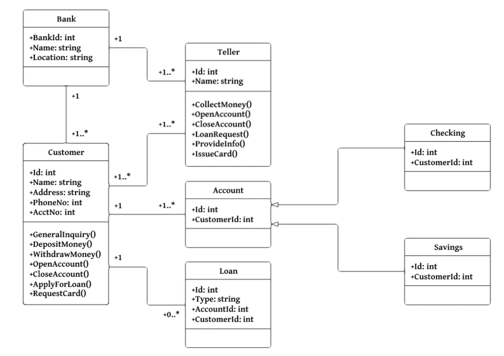
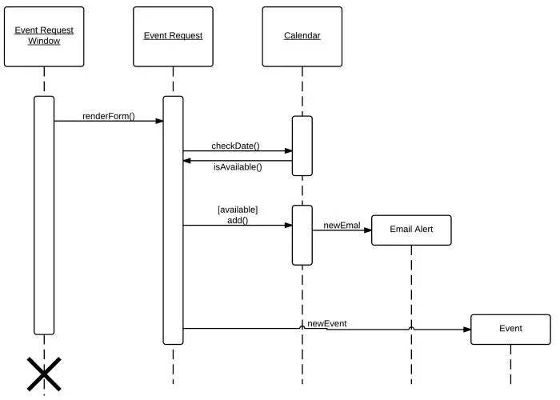
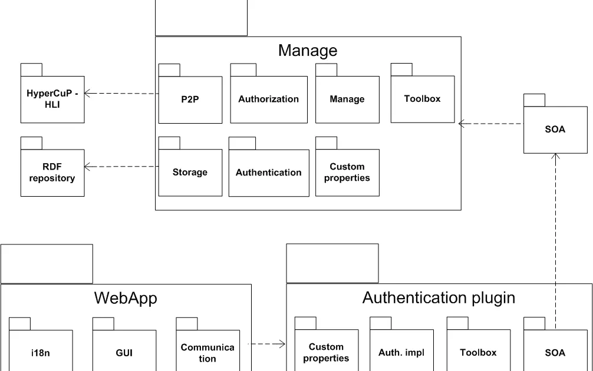
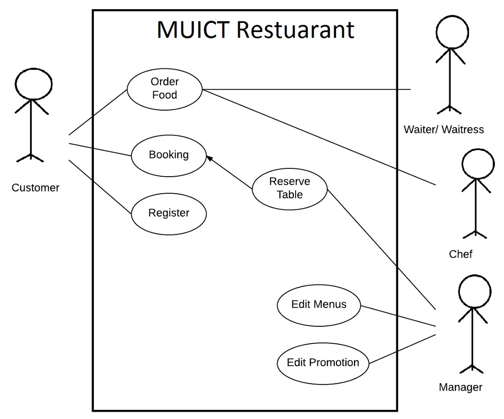
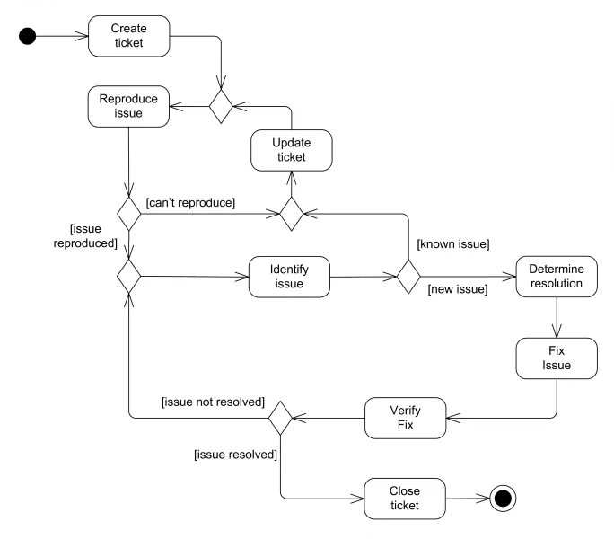
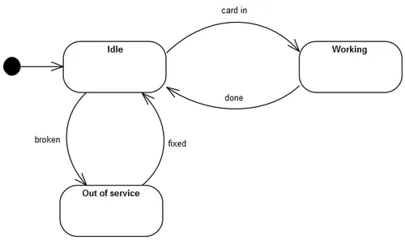

# Unified Modeling Language (UML)

## Introduction

UML is a language for visualizing, specifying, constructing, and documenting
the artifacts of software systems, as well as for business modeling.

## UML Diagrams

There is a wide variety of UML diagrams. You can choose the one that best suits
your needs. The most common ones are:

### Class Diagram

A class diagram is a static view of a system. It shows the classes of the
system, their attributes, operations (or methods), and the relationships
between objects.

### Sequence Diagram

A sequence diagram shows interactions between objects in a system. It shows
which messages are sent to which objects and in what order.

### Package Diagram

A package diagram shows the packages of a system and the relationships between
them.

### Use Case Diagram

- Identify main & secondary actors;
- Define functions actors will use;
- Actors can be real persons or other systems;
- For a system, there are as many use case diagrams as package programs.

On the left: main actors. On the right: secondary actors;

### Activity Diagram

An activity diagram shows the flow of control in a system. It shows the
activities of a system and the control flow between them.

### State Machine Diagram

A state machine diagram shows the states of an object and the transitions
between those states.

