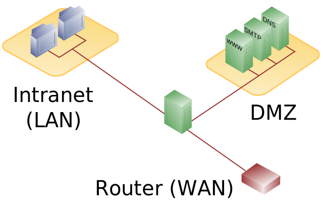

# Demilitarized Zone (DMZ)

- Subnet that sits between the internet (WAN) and the internal network (LAN);
- Contains services that are accessible from the internet (e.g. web server, mail
server, etc.);
- Connected to the WAN & LAN through a firewall;
- Additional security layer for the LAN, since hackers only have access to the
DMZ, not the LAN.

*Diagram of a typical three-legged network model employing a DMZ using a single
firewall.*

## References

- [DMZ (computing) - Wikipedia](DMZ_(computing))
