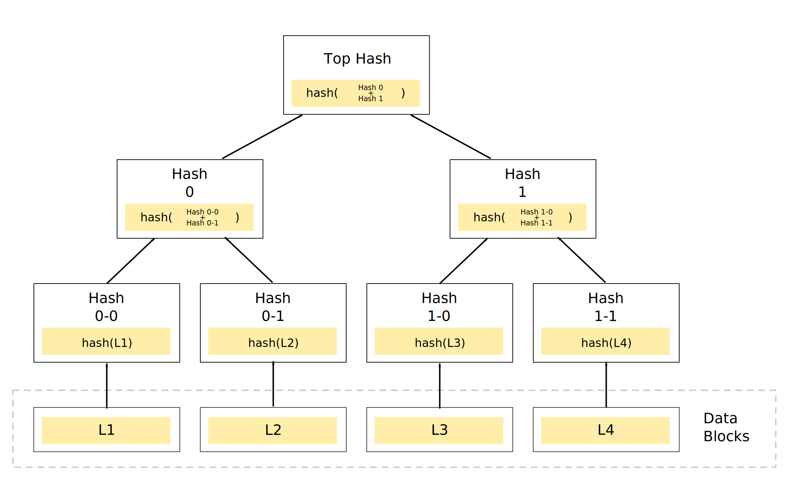

# Merkle tree (hash tree)

## Definition

Tree data structure where every leaf node is labelled with the hash of a
data block and every non-leaf node is labelled with the cryptographic hash of
the labels of its child nodes.

Most of merkle trees are binary trees, but they can have more than two child
nodes.

## Use Cases

- Peer-to-peer (P2P) networks ([Bitcoin](../../blockchain/networks/bitcoin.md),
  [Ethereum](../../blockchain/networks/ethereum/ethereum.md), ...);
- File systems (IPFS, Btrfs, ZFS, ...) to counter data degradation;
- Version control systems (Git, Mercurial, ...) to detect changes to files;
- NoSQL databases (Apache Cassandra, Riak, Dynamo, ...).

## Properties

- Need log(n) hashes to verify a root hash, where n is the number of leaves;
- For binary merkle trees, indexes of left leaves are even numbers and indexes
  of right leaves are odd numbers;
- For binary merkle trees, the number of leaves is always a power of 2;
- 
