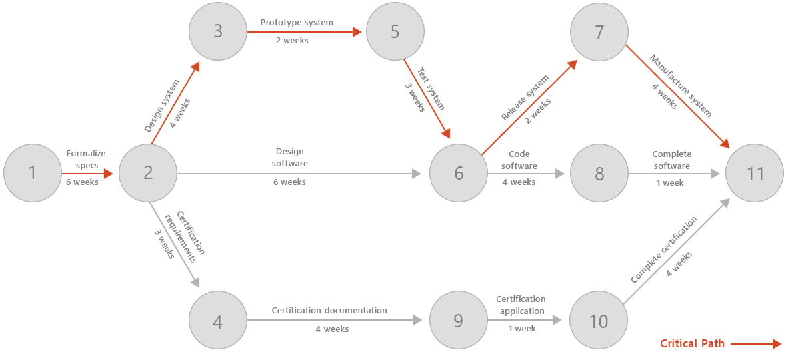
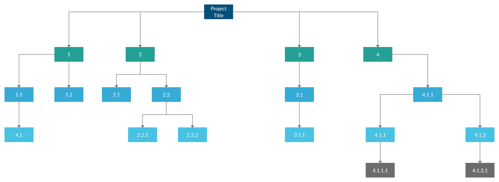

# Project Management

## PERT Chart

- Stands for Program Evaluation & Review Technique;
- Used to plan and control projects;
- Shows the tasks involved in the project, the sequence of tasks, and the time 
  required to complete each task;
- Shows the critical path of the project (the longest path of tasks that must be 
  completed to finish the project);

   

## WBS Chart

- Stands for Work Breakdown Structure;
- Shows the hierarchy of the project tasks;
- Shows the relationship between the tasks;
- Shows the dependencies between the tasks.

