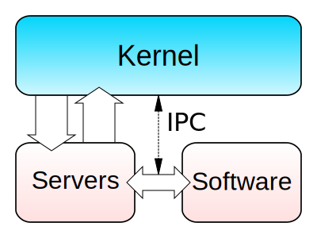

# Operating systems

## Introduction

An operating system is a system software that manages computer hardware,
software resources, and provides common services for computer programs.

Without an OS, only one software would run and would be in charge of
everything on the computer, including the hardware.

## System & application softwares

**System softwares** are in charge of:

- managing **memory**;
- managing **programs execution**;
- allowing several programs to **exchange data between them**;
- managing all **computer's peripherals**;
- managing **files**, **network**, **sound** & **display**.

**Application softwares** let the **user** do **tasks** that may involve
calls to some system softwares.

But depending on the hardware, an OS can't manage all devices or peripherals.
That's why the computer needs **drivers**, which is a system software, often
provided by the manufacturer of the device.

## System calls

When an application software executes a system software, it makes a **system**
**call**. In order to make one, softwares will use a processor functionality,
called **interrupt**.

### Interrupts

An interrupt is a request for the processor to **stop currently executing**
**program in order to execute another one**. After this last program is done,
it **resumes the stopped program**. It is **stored in the processor**.

When the interrupt is requested, it runs an **Interrupt Service Routine**
(or **ISR**).

Since there is a lot of different devices & peripherals, there is multiple ISR.
That's why we use an **interrupt vector table**.

### Interrupt vectors

An interrupt vector is a pointer that stores the **address of an interrupt**
**handler**.

First, it is **initialized by the BIOS** during the booting process. Then, the
**OS will replace this interrupt handler** by its own one.

Since there is multiple interrupt vector in a system, those are stored in an
**interrupt vector table**, that associate a list of interrupt handlers with a
list of interrupt requests. It is **stored in the memory**.

### Interrupt requests

On x86 processors, `INT` is the assembly language instruction (or machine
instruction) that generates an interrupt.

This instruction needs some **parameters** in order to work, such as the number
or the address of an interrupt, ... For example, an ISR for printing a letter
on the screen will need the letter to display as a parameter.

Those parameters are copied in ultra-fast memory in the processor, called
**registers**.

## Kernel

A **kernel** is the **core program** of a computer's OS that has **complete**
**control over everything** in the system. It is **always resident in memory**.

Its objectives are:

- To establish communication between user level application and hardware;
- To decide state of incoming processes;
- To control disk management;
- To control memory management;
- To control task management.

### Types of kernel

#### Megalithic

#### Monolithic

- All OS services operate in the kernel;
- Every services are called through system calls.

**Pros:**

- Fast because processes are in the same space.

**Cons:**

- If one service crashes, the whole OS crashes;
- Hard to maintain due to the size of the kernel;
- Adding a new service requires to modify the entire kernel.

**Examples:**

- Unix;
- Linux;
- Open VMS;
- XTS-400.

#### Micro

- OS services are implemented into different spaces (kernel & user space for
  example);
- Services are called through IPC (Inter Process Communication) mechanisms;
- Minimalist approach.

**Pros:**

- Stable because if a service in user space crashes, the kernel is not
  affected;
- Easy to maintain due to the small size of the kernel.

**Cons:**

- Slower because there are lot of context switches between kernel & user
  space.

**Examples:**

- Mach;
- L4;
- AmigaOS;
- Minix;
- K42.

#### Hybrid

- Mix of monolithic & micro kernels;
- Micro kernel with some non-essential code in kernel space (like networking
  or file system).

**Pros:**

- Tries to get the best of both worlds.

**Cons:**

- More complex than micro kernels.

**Examples:**

- Windows NT;
- Netware;
- BeOS.

#### Exo

#### Nano

### Linux kernel

### Windows kernel

## Boot

### Linux booting process

1. Power on
2. POST
3. BIOS
4. MBR
5. GRUB
6. Kernel
7. Systemd (Init)

## References

- [What is Kernel and different types of Kernels?](https://www.tutorialspoint.com/what-is-kernel-and-different-types-of-kernels)
- [Kernel in Operating System](https://www.geeksforgeeks.org/kernel-in-operating-system/)
- [Kernel (operating system)](https://en.wikipedia.org/wiki/Kernel_%28operating_system%29)
